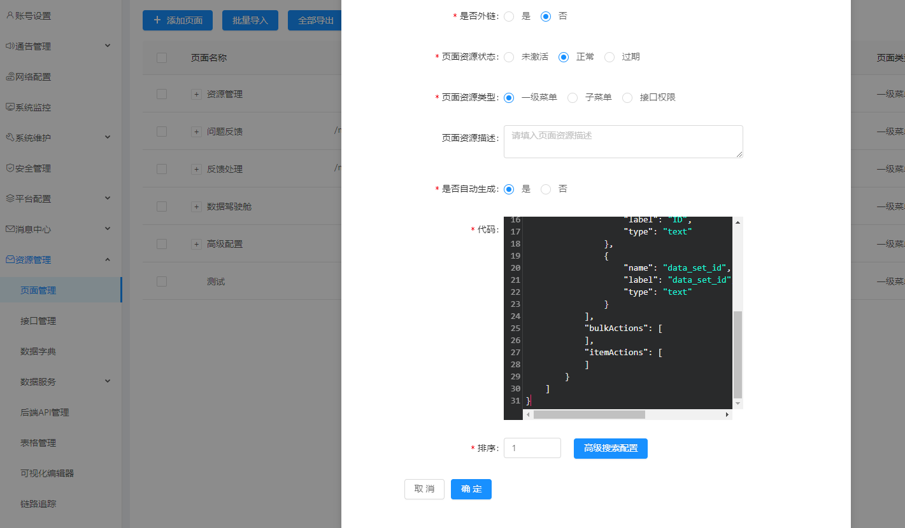

# mhtss

##  项目简介

问题：在企业中的大部分后端管理系统和常规客户端系统中，很大部分都是crud操作，复杂点的就表关联，一对多，多对多等，开发团队配置的依赖等等情况。 

 

初衷：想要做到真正的快速、安全的低/零代码工作，权限动态化，页面动态化，接口的创建也动态化；

通过高度的抽象，将页面元素封装为基础组件和业务组件，将业务规则、权限等封装为规则配置、公式和可拖拽的流程设计器，通过拖拽以及配置，无需写代码，即可完成符合业务需求的应用系统搭建。

对于大部分常用页面，应该使用最简单的方法来实现，甚至不需要学习前端框架和工具。高效、高性能的拖拽式低代码开发平台，将繁琐的底层架构和基础设施抽象化为图形界面，通过组件化模板、拖放式组件和可视化配置快速构建多端应用（移动端和Web端等），免去了代码编写工作，能够完全专注于业务场景。


**前端：不适用于大量定制 UI 和 极为复杂或特殊的交互, 但可共存**

**后端：不适用于大量业务逻辑在一个方法中, 但可共存**


## 技术架构

### 开发环境

- 语言：Java 8
- IDE(JAVA)： IDEA / Eclipse安装lombok插件
- IDE(前端)： WebStorm 或者 IDEA
- 依赖管理：Maven
- 数据库：MySQL5.7+
- 缓存：Redis

### 后端

- 基础框架：Spring Boot 2.2.5.RELEASE
- 持久层框架：Mybatis-plus 3.4.1
- 安全框架：Apache Shiro 1.7.0，Jwt 3.11.0
- 数据库连接池：阿里巴巴Druid 1.1.22
- 缓存框架：redis
- 日志打印：logback
- 消息队列：rabbitMq
- 定时执行框架: xxl-job
- 其他：fastjson,Swagger-ui ,easyExcel,lombok,hutool等。

### 前端

- node >= v14
- amis >= v1.2.4-beta.11
- vue >= v2.6.14
- yarn >= v1.12.5
- webpack >= v4.31.0
- Echarts>= v4.2.1
- eslint >=v5.16.0


###  项目结构

```
mhtss   
├── mhtss-base                               // 核心工程
│       └── mhtss-base-common             // 通用been
│       └── mhtss-base-core                    // 核心控制
├── mhtss-cloud                                 // 组件服务
│       └── mhtss-cloud-websocket             // websocket服务
│       └── mhtss-cloud-xxljob                 // 任务调度
├── mhtss-face                                 // 接口服务
│       └── mhtss-face-core                   // 核心接口服务
│       └── mhtss-face-websocket         // websocket接口服务
├── mhtss-module                            // 业务服务
│       └── mhtss-module-dbapi-parent         // 低代码sql服务
│       └── mhtss-module-system          // 核心服务

mhtss-base-core   
├── async                          // 同步线程
├── common                     // 通用服务
│       └── aspect             // 日志、字典记录   
│       └── constant               // 常量
│       └── oss                      // 上传下载工具
├── config                      // 系统参数配置
├── exception                 // 异常处理  
├── model                       // 通用模型
├── util                           // 工具类
```


### 部署

zookeeper
	端口： 2181

redis
	端口： 6379
	database： 13
	密码： XXX

rabbitmq
	端口： 15672、5672
	账号： XXX
	密码： XXX

minio
	端口： 9900、9901
	账号： XXX
	密码： XXX

mysql
	端口： 3307
	账号： XXX
	密码： XXX

elasticsearch
	端口： 9200、9300

skywalking-oap
	端口： 11800、12800

skywalking-ui
	端口： 8888

knife4j
	端口： 8083

mhtss-cloud-xxl-job
	端口： 9881
	账号： XXX
	密码： XXX

mhtss-module-dbapi
	端口： 9852

mhtss-module-system
	端口： 9896、10007

mhtss-module-magic
	端口： 9897

mhtss-cloud-websocket
	端口： 9832、10504

mhtss-cloud-gateway
	端口： 8083

amis-editor
	端口： 8082

mhtss-ui
	端口： 8000
	账号： XXX
	密码： XXX

jenkins
	账号： XXX
	密码： XXX

nacos
	端口： 8848
	账号： XXX
	密码： XXX

harbor		
	端口： 8080
	账号： XXX
	密码： XXX

Mysql监控 / Redis监控
	端口： 9302
	账号： XXX
	密码： XXX

####  /etc/hosts

```
127.0.0.1 mhtss-mysql
127.0.0.1 mhtss-redis
127.0.0.1 mhtss-minio
127.0.0.1 mhtss-rabbitmq
127.0.0.1 mhtss-skywalking
127.0.0.1 mhtss-zookeeper
127.0.0.1 mhtss-nacos
127.0.0.1 mhtss-xxl-job-admin
127.0.0.1 mhtss-module-dbapi
127.0.0.1 mhtss-module-system
127.0.0.1 mhtss-module-magic
127.0.0.1 mhtss-cloud-websocket
127.0.0.1 mhtss-cloud-gateway
```


## 应用

#### 通过快速配置满足metabase，finebi等大屏需求。

① 添加数据源

 

② 添加接口

 

③ Sql配置

 

 

④ 应用注册及绑定接口

 

 

⑤ 接口测试

 

 

 

#### 带权限接口注册

① 定义接口

 

② 定义页面

 

 

 

③ 页面查看

 

 

***PS：*** 接口定义当前支持的方式如下：

 

 

 

#### 链路追踪

· 基于字节码注入、源码span自定义和日志统一接入的方式，追踪、监控和诊断分布式系统,包括 分布式追踪和上下文传输；应用、实例、服务性能指标分析；根源分析；应用拓扑分析；应用和服务依赖分析；慢服务检测；性能优化。

 

 

 

 

 

 

 

#### Q&A

Q：对于组件的扩展和沉淀

A：

 

 

##  感谢

> 本项目得到以下项目的支持与帮助，在此表示衷心的感谢！
>
> https://github.com/RotaNova/asmoboot
>
> https://gitee.com/ssssssss-team/magic-api
